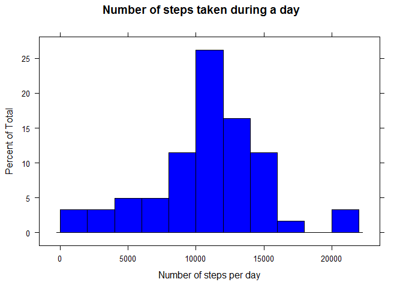
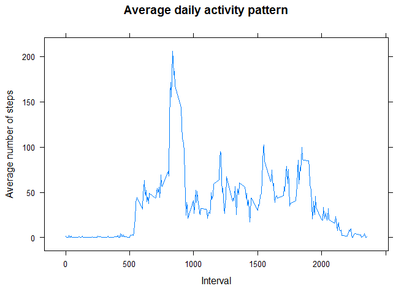
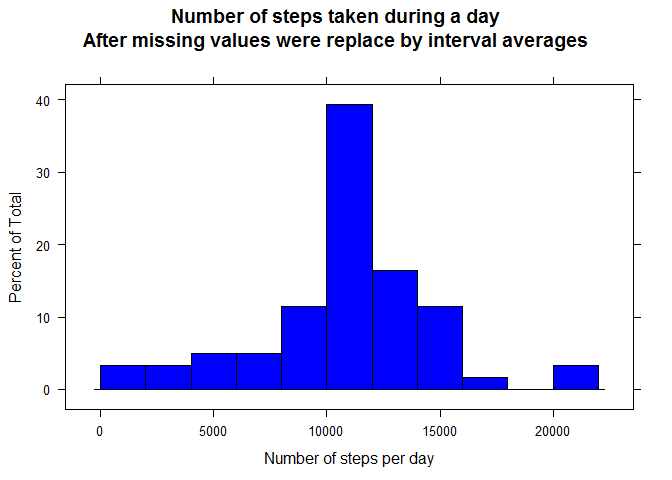
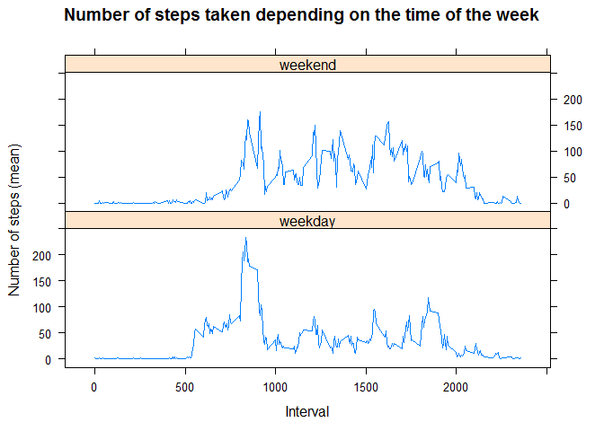

# Reproducible Research: Peer Assessment 1

The following report was created as a Peer Assignment project for Reproducible Research course at Coursera.org. The purpose of the report is to document every procedure and change that has been made during the preliminary analysis of Mobile Devices data set.  

## Loading and preprocessing the data

The data can be downloaded from [here](https://d396qusza40orc.cloudfront.net/repdata%2Fdata%2Factivity.zip)  
1. Reading in the data set.


```r
tmp <-unzip("activity.zip")
activity <- read.csv(tmp)
```

2. Changing the type of the date column to date values.


```r
activity$date <- as.Date(activity$date, "%Y-%m-%d")
```

## What is the mean total number of steps taken per day?

1. Calculate the total number of steps taken per day. Create a table with the results.


```r
require(dplyr)
sum_tbl <-activity %>%
    group_by(date) %>%
    summarise(total_steps=sum(steps))
head(sum_tbl)
```

```
## Source: local data frame [6 x 2]
## 
##         date total_steps
## 1 2012-10-01          NA
## 2 2012-10-02         126
## 3 2012-10-03       11352
## 4 2012-10-04       12116
## 5 2012-10-05       13294
## 6 2012-10-06       15420
```
  
2. Make a histogram of the total number of steps taken each day.


```r
require(lattice)
histogram(~sum_tbl$total_steps, main="Number of steps taken during a day", xlab="Number of steps per day", col="blue", breaks=10)
```

 
  
3. Calculate and report the mean and median of the total number of steps taken per day  
The average of total number of steps taken per day.  


```r
mean(sum_tbl$total_steps, na.rm=T)
```

```
## [1] 10766.19
```

The median of the total number of steps taken per day.

```r
median(sum_tbl$total_steps, na.rm=T)
```

```
## [1] 10765
```
## What is the average daily activity pattern?

1. Make a time series plot (i.e. type = "l") of the 5-minute interval (x-axis) and the average number of steps taken, averaged across all days (y-axis)


```r
require(dplyr)
sum_tbl2 <- activity %>%
    group_by(interval) %>%
    summarise(stepsPerInt=mean(steps, na.rm=T))
xyplot(sum_tbl2$stepsPerInt~sum_tbl2$interval, type="l", main="Average daily activity pattern", xlab="Interval", ylab="Average number of steps")
```

 

2. Which 5-minute interval, on average across all the days in the data set, contains the maximum number of steps?  

```r
sum_tbl2[which.max(sum_tbl2$stepsPerInt),]$interval
```

```
## [1] 835
```

## Imputing missing values

1. Calculate and report the total number of missing values in the data set (i.e. the total number of rows with NAs)

```r
#return rows with NA values
x <-activity[!complete.cases(activity),]
#check whether there are missing values in the date or interval columns
if(sum(is.na(x$interval)) == 0 && sum(is.na(x$date))==0){
    #calculate missing values from the steps column
    total.na <- length(x$steps)
}
print(total.na)
```

```
## [1] 2304
```

2. Devise a strategy for filling in all of the missing values in the data set. The strategy does not need to be sophisticated. For example, you could use the mean/median for that day, or the mean for that 5-minute interval, etc.

**Method:**  
Calculate the mean of 5 the minute intervals and replace the missing values with them.
**Steps:**  
- create a new vector for the new step values (`steps_new`)
- use the means steps per interval values that have been calculated in the `sum_tbl2` (`stepsPerInt` column) for substituting the missing values


```r
steps_new <- activity$steps
naInd <- which(is.na(steps_new))
for (i in naInd){
        #find matching value in the summary table and replace it
        steps_new[i] <-sum_tbl2$stepsPerInt[which(sum_tbl2$interval==activity$interval[i])]
}

#check that all the NAs removed
sum(is.na(steps_new))
```

```
## [1] 0
```

3. Create a new data set that is equal to the original data set but with the missing data filled in.


```r
new.df <- cbind(steps_new, activity[,2:3])
```

4. Make a histogram of the total number of steps taken each day and Calculate and report the mean and median total number of steps taken per day. Do these values differ from the estimates from the first part of the assignment? What is the impact of imputing missing data on the estimates of the total daily number of steps?


```r
#total number of steps taken by day
nw.steps.per.day <-new.df %>%
    group_by(date) %>%
    summarise(total_steps=sum(steps_new))

histogram(~nw.steps.per.day$total_steps, main="Number of steps taken during a day\nAfter missing values were replace by interval averages", xlab="Number of steps per day", col="blue", breaks=10)
```

 

```r
#mean
mean(nw.steps.per.day$total_steps)
```

```
## [1] 10766.19
```

```r
#median
median(nw.steps.per.day$total_steps)
```

```
## [1] 10766.19
```

Since the average steps per interval was used to impute the missing values, it slightly shifted the data set towards the average. However, the impact wasn't dramatic.

## Are there differences in activity patterns between weekdays and weekends?

1. Create a new factor variable in the data set with two levels – “weekday” and “weekend” indicating whether a given date is a weekday or weekend day.


```r
#change the language to English
Sys.setlocale("LC_TIME", "English")
```

```
## [1] "English_United States.1252"
```

```r
w.factor <- weekdays(activity$date) == "Saturday" | weekdays(activity$date) == "Sunday"
activity$wday <- factor(w.factor, levels=c(FALSE, TRUE), labels=c("weekday", "weekend"))
```

2. Make a panel plot containing a time series plot (i.e. type = "l") of the 5-minute interval (x-axis) and the average number of steps taken, averaged across all weekday days or weekend days (y-axis). See the README file in the GitHub repository to see an example of what this plot should look like using simulated data.


```r
w.tbl <-activity %>%
    group_by(wday,interval)%>%
    summarise(total_steps=mean(steps, na.rm=T))
require(lattice)
xyplot(w.tbl$total_steps~w.tbl$interval|w.tbl$wday, type="l", xlab="Interval", ylab="Number of steps (mean)", main="Number of steps taken depending on the time of the week", layout=c(1,2))
```

 
